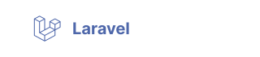

# [Utomic Media](https://utomic.media)
### German based agency for Webdevelopment, Webdesign, WebApps, Rest-APIs and headless CMS  👋

<!--
**utomic-media/.github** is a ✨ _special_ ✨ repository because its `README.md` (this file) appears on your GitHub profile.
-->
* ℹ️ &nbsp; **[Website](https://utomic.media)** — Visit our website and references
* 📩 &nbsp; **[Email](mailto:hey@utomic.media)** — _Reach out regarding any projects and inquiries_
* 💡 &nbsp; **[Contact](https://utomic.media/kontakt)** — _Feel free to contact us_

<!-- TODO: create tags out of svgs / use list -->
<!-- TODO:  Add Utomic logo to the end -->
<!-- TODO: icon alignment and spacing -->
<!-- TODO: stash commit history (simply "add readme") -->
<!-- TODO: display on github profile -->

### Services

     
### Tools

### Programming languages

### Coming soon...

