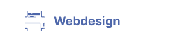

# [Utomic Media](https://utomic.media)
### German based agency for Webdevelopment, Webdesign, WebApps, Rest-APIs and headless CMS  👋

<!--
**utomic-media/.github** is a ✨ _special_ ✨ repository because its `README.md` (this file) appears on your GitHub profile.
-->
* ℹ️ &nbsp; **[Website](https://utomic.media)** — Visit our website and references
* 📩 &nbsp; **[Email](mailto:hey@utomic.media)** — _Reach out regarding any projects and inquiries_
* 💡 &nbsp; **[Contact](https://utomic.media/kontakt)** — _Feel free to contact us_

<!-- TODO: create tags out of svgs / use list -->
<!-- TODO:  Add Utomic logo to the end -->
<!-- TODO: icon alignment and spacing -->
<!-- TODO: stash commit history (simply "add readme") -->
<!-- TODO: display on github profile -->

### Services

 `Webdevelopment`
 `Webdesign`
 `CMS`
 `Newsletter`
 `Online-Marketing`
 `Online-Shops`
 `Plugins and Extensions`
     
### Tools
 `WordPress`
 `Directus`
 `VueJs`
 `Nuxt`
 `Vuetify`
 `Tailwind`
 `Express`
 `Laravel`

### Programming languages
 `JavaScript`
 `NodeJs`
 `PHP`
 `SASS/SCSS`
 `CSS`
 `REST-API`

### Coming soon...
 `Your Project`

 `Utomic Media`

